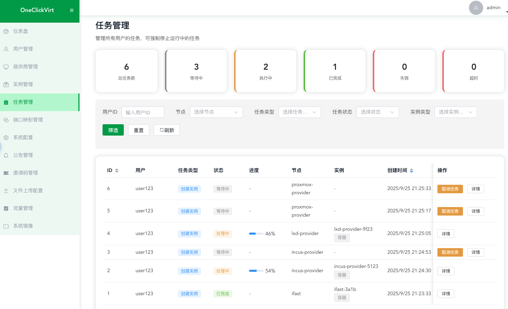

# OneClickVirt 虚拟化管理平台

一个可扩展的通用虚拟化管理平台，支持 LXD、Incus、Docker 和 Proxmox VE。

## 详细说明

[www.spiritlhl.net](https://www.spiritlhl.net/)

## 快速开始

### 环境要求

* Go 1.24.5
* Node.js 22+
* npm 或 yarn

### 环境部署

1. 构建前端
```bash
cd web
npm i
npm run build
```

2. 构建后端
```bash
cd server
go mod tidy
go build -o oneclickvirt main.go
```

3. 挂起执行后端的二进制文件```oneclickvirt```。

4. 配置域名绑定静态文件夹，不需要反代后端，vite已自带后端代理请求。

5. 安装mysql后，创建一个空的数据库```oneclickvirt```。

6. 访问你的域名，自动跳转到初始化界面，填写数据库信息(root用户)和相关信息，点击初始化。

7. 完成初始化后会自动跳转到首页，可以自行探索并使用了。

### 本地开发

* 前端：[http://localhost:8080](http://localhost:8080)
* 后端 API：[http://localhost:8888](http://localhost:8888)
* API 文档：[http://localhost:8888/swagger/index.html](http://localhost:8888/swagger/index.html)

## 默认账户

系统初始化后会生成以下默认账户：

* 管理员账户：`admin / Admin123!@#`
* 普通用户：`testuser / TestUser123!@#`

> 提示：请在首次登录后立即修改默认密码。

## 配置文件

主要配置文件位于 `server/config.yaml`

## 演示截图



