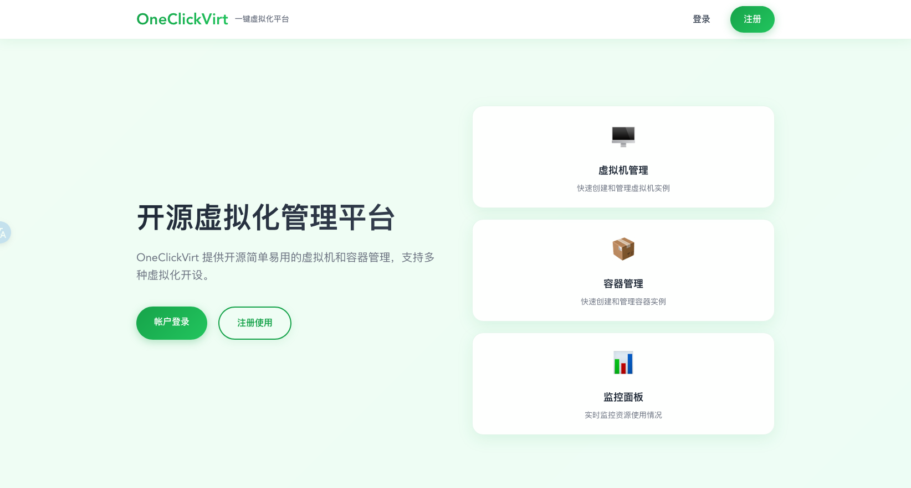

# OneClickVirt Virtualization Management Platform

A scalable universal virtualization management platform that supports LXD, Incus, Docker, and Proxmox VE.

## Detailed Description

[www.spiritlhl.net](https://www.spiritlhl.net/)

## Quick Start

### Environment Requirements

* Go 1.24.5
* Node.js 19+
* npm or yarn

### Service Addresses

* Frontend: [http://localhost:8080](http://localhost:8080)
* Backend API: [http://localhost:8888](http://localhost:8888)
* API Documentation: [http://localhost:8888/swagger/index.html](http://localhost:8888/swagger/index.html)

### Initialization Steps

1. Visit [http://localhost:8080](http://localhost:8080), it will automatically redirect to the system initialization page.
2. Set up administrator account information.
3. After initialization is complete, you can use it normally.

## Default Accounts

After system initialization, the following default accounts will be generated:

* Administrator account: `admin / Admin123!@#`
* Regular user: `testuser / TestUser123!@#`

> Tip: Please change the default password immediately after first login.

## Configuration File

The main configuration file is located at `server/config.yaml`

## Technology Stack

### Backend

* Gin Web Framework
* GORM ORM
* MySQL Database
* JWT Authentication

### Frontend

* Vue 3
* Vite
* Element Plus
* Pinia
* Vue Router

## Deployment Instructions

### Production Environment Deployment

1. Build frontend
```bash
cd web
npm run build
```

2. Build backend
```bash
cd server
go build -o oneclickvirt main.go
```

3. Configure reverse proxy (Nginx is recommended).
4. Set environment variable `GIN_MODE=release`.

## Demo Screenshots





